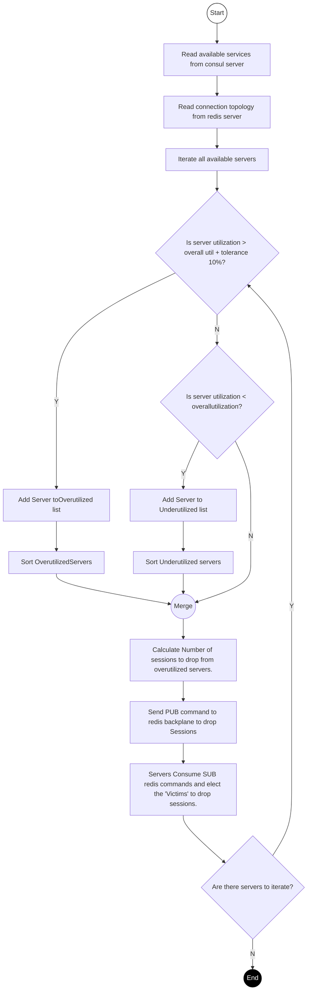
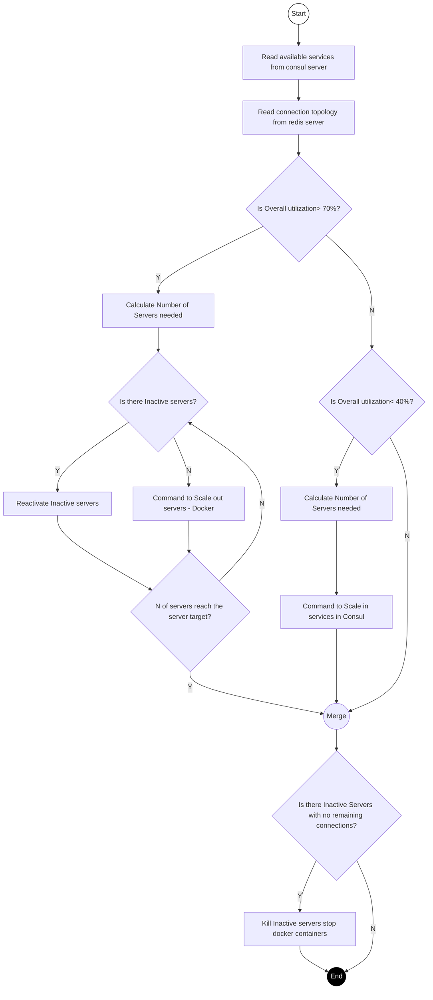

# Connection Rebalancer App

The purpose of this project is to read the state of connections from consul services and redis to scale servers/containers according to the connection count.
Furthermore, send Redis Pub/sub admin commands for specific servers to shed connections with the purpose of rebalancing the network connection topology.

Bellow is a visual representation of the rebalancing logic & Scaling logic.

### Rebalancing Connections

> **Formulas:**
> - `activeSessionAverageThreshold = ROUNDUP(maxSessionPerHost * overallUtilizationPercent)`
> - `sessionsToOffload = activeSessions - activeSessionAverageThreshold`

---

### Scaling Connections

