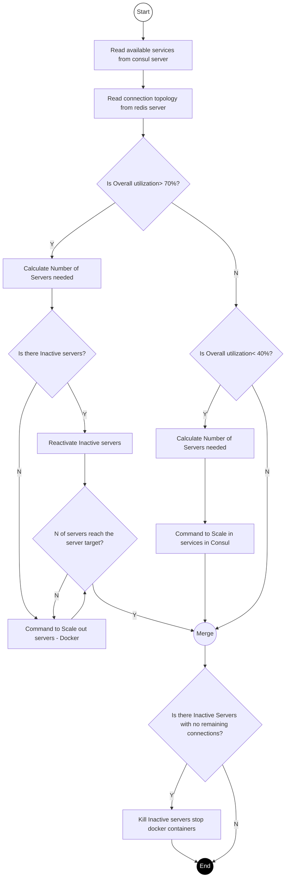

# Connection Rebalancer App

An automated scaling and rebalancing application that monitors Consul and Redis connection counts to scale containers and shed connections via Redis Pub/Sub for optimal network topology.

Bellow is a visual representation of the rebalancing logic & Scaling logic.

### Rebalancing Connections

```mermaid
flowchart TD
    Start((Start)) --> A[Read available services from consul server]
    A --> B[Read connection topology from redis server]
    B --> C[Iterate all available servers]
    C --> D{Is server utilization > (overall utilization + 10%)?}
    D -- Y --> E[Add Server to overutilized list]
    E --> F[Sort Overutilized Servers]
    F --> Merge((Merge))
    D -- N --> G{Is server utilization < overall utilization?}
    G -- Y --> H[Add Server to Underutilized list]
    H --> I[Sort Underutilized servers]
    I --> Merge
    G -- N --> Merge
    Merge --> J[Calculate Number of sessions to drop from overutilized servers.]
    J --> K[Send PUB command to redis backplane to drop Sessions]
    K --> L[Servers Consume SUB redis commands and elect the 'Victims' to drop sessions.]
    L --> M{Are there servers to iterate?}
    M -- Y --> D
    M -- N --> End((End))

    style Start fill:#fff,stroke:#000
    style End fill:#000,stroke:#000,color:#fff
```

> **Formulas:**
> - `activeSessionAverageThreshold = ROUNDUP(maxSessionPerHost * overallUtilizationPercent)`
> - `sessionsToOffload = activeSessions - activeSessionAverageThreshold`

---

### Scaling Connections


